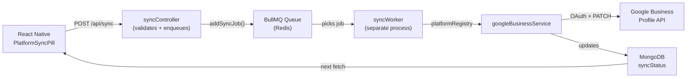

# Walkthrough: Platform Sync Architecture

## What Was Built

A production-grade **background job system** using BullMQ + Redis that syncs business locations to Google Business Profile. The architecture is **pluggable** — adding Facebook, Bing, or Apple Maps later requires only 1 new service file + 1 line in the registry.

---

## Architecture Diagram



---

## Files Created/Modified (15 total)

### New Backend Files (9)

| File | Purpose |
|------|---------|
| [redis.js](file:///c:/go-up-google/backend/src/config/redis.js) | IORedis connection factory with reconnection strategy |
| [syncQueue.js](file:///c:/go-up-google/backend/src/queues/syncQueue.js) | BullMQ queue with exponential backoff (3 attempts, 2s→4s→8s) |
| [user.model.js](file:///c:/go-up-google/backend/src/models/user.model.js) | User model with `oauthTokens` Map for multi-platform OAuth |
| [sync.controller.js](file:///c:/go-up-google/backend/src/features/sync/sync.controller.js) | POST /api/sync — validates, marks 'syncing', enqueues, returns 202 |
| [sync.routes.js](file:///c:/go-up-google/backend/src/features/sync/sync.routes.js) | Route registration with firebaseAuth |
| [platformRegistry.js](file:///c:/go-up-google/backend/src/services/platforms/platformRegistry.js) | Plugin map: `{ google: googleBusinessService }` |
| [googleBusinessService.js](file:///c:/go-up-google/backend/src/services/platforms/googleBusinessService.js) | OAuth token refresh, WeeklyHours→GBP conversion, CREATE/UPDATE |
| [syncWorker.js](file:///c:/go-up-google/backend/src/workers/syncWorker.js) | Standalone worker: MongoDB + Redis, routes to platform services |

### Modified Backend Files (4)

| File | Change |
|------|--------|
| [location.model.js](file:///c:/go-up-google/backend/src/features/locations/location.model.js) | Added `syncStatus[]` embedded array (platform, state, lastSyncedAt, errorMessage, externalId) |
| [server.js](file:///c:/go-up-google/backend/src/server.js) | Registered `/api/sync` routes |
| [.env](file:///c:/go-up-google/backend/.env) | Added `REDIS_URL` |
| [package.json](file:///c:/go-up-google/backend/package.json) | Added `bullmq`, `ioredis`, `worker`/`worker:dev` scripts |

### Modified Frontend Files (3)

| File | Change |
|------|--------|
| [syncService.ts](file:///c:/go-up-google/frontend/features/home/services/syncService.ts) | Replaced mock setTimeout with real `POST /api/sync` via axiosInstance |
| [home/types/index.ts](file:///c:/go-up-google/frontend/features/home/types/index.ts) | Maps real `syncStatus[]` from API → `PlatformSyncStatus[]` |
| [locations/types.ts](file:///c:/go-up-google/frontend/features/locations/types.ts) | Added `SyncStatusEntry` interface + `syncStatus` to `LocationDocument` |

---

## How to Run

### Terminal 1 — Express API Server
```bash
cd backend
npm run dev
```

### Terminal 2 — BullMQ Worker
```bash
cd backend
npm run worker:dev
```

### Redis (required)
Make sure Redis is running at `redis://127.0.0.1:6379` (or update `REDIS_URL` in `.env`).

---

## How to Add a New Platform

> Adding Facebook, for example:

1. **Create** `src/services/platforms/facebookService.js`:
   ```js
   async function sync(location, userTokens) {
     // Facebook Graph API logic here
     return { externalId: 'fb_page_123' };
   }
   module.exports = { sync };
   ```

2. **Register** in [platformRegistry.js](file:///c:/go-up-google/backend/src/services/platforms/platformRegistry.js):
   ```js
   facebook: require('./facebookService'),
   ```

3. **Done.** The controller, queue, and worker require **zero changes**.

---

## Data Flow (End to End)

1. User taps Google sync pill → `syncService.ts` calls `POST /api/sync { locationId, platforms: ['google'] }`
2. Controller validates → sets `syncStatus.google.state = 'syncing'` in DB → enqueues BullMQ job → returns `202`
3. Worker picks up job → looks up `google` in `platformRegistry` → calls `googleBusinessService.sync()`
4. GBP service refreshes OAuth token → converts hours → calls GBP API → returns `{ externalId: 'locations/123' }`
5. Worker updates DB: `syncStatus.google.state = 'success'`, `lastSyncedAt = now`, `externalId = 'locations/123'`
6. User pull-to-refreshes → `GET /api/locations` returns updated `syncStatus` → green checkmark appears

---

## Before First Sync — Required Setup

> [!IMPORTANT]
> You need to create a **User** document in MongoDB with your Google OAuth tokens:

```js
// Run in MongoDB shell or a seed script:
db.users.insertOne({
  firebaseUid: "<your_firebase_uid>",
  oauthTokens: {
    google: {
      refreshToken: "<your_google_refresh_token_from_.env>",
      accountId: "accounts/<your_gbp_account_id>"
    }
  }
});
```

To find your GBP account ID, you can use the existing refresh token:
```bash
# Get a fresh access token
curl -X POST https://oauth2.googleapis.com/token \
  -d "client_id=<CLIENT_ID>&client_secret=<CLIENT_SECRET>&refresh_token=<REFRESH_TOKEN>&grant_type=refresh_token"

# List your GBP accounts
curl -H "Authorization: Bearer <ACCESS_TOKEN>" \
  "https://mybusinessbusinessinformation.googleapis.com/v1/accounts"
```
